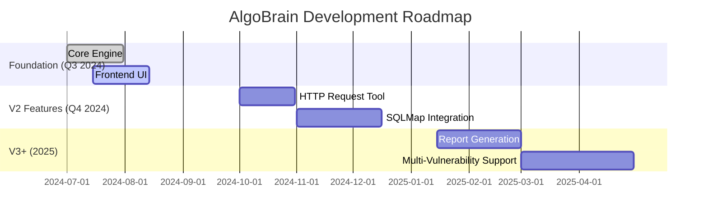

# AlgoBrain 🧠

**An AI-Powered Pentesting Assistant for SQL Injection Vulnerabilities**

AlgoBrain is an intelligent cybersecurity assistant designed to help penetration testers identify, understand, and analyze SQL injection vulnerabilities. Built on cutting-edge AI technology, it combines the power of Google's Gemini LLM with specialized tools for web search and vector database queries to accelerate the pentesting workflow.

## 🎯 Overview

AlgoBrain acts as an interactive partner that augments pentester workflows by:
- **Automating Research**: Intelligent web search and specialized security knowledge queries
- **Providing Expert Guidance**: AI-powered analysis and suggestions for SQL injection testing
- **Streamlining Workflows**: Real-time conversation interface with tool integration
- **Maintains Context**: Stateful conversations that remember your testing session.

## 📚 Table of Contents

- [🎯 Overview](#-overview)
- [🤔 Why Contribute?](#-why-contribute)
- [✨ Showcase](#-showcase)
- [🚀 Quick Start](#-quick-start)
- [⚙️ Configuration](#️-configuration)
- [🎮 Usage](#-usage)
- [🛠️ Technology Stack](#️-technology-stack)
- [🧪 Features](#-features)
- [🔒 Security Considerations](#-security-considerations)
- [📁 Project Structure](#-project-structure)
- [🤝 How to Contribute](#-how-to-contribute)
- [✨ Contributors](#-contributors)
- [📞 Support](#-support)

## 🏗️ Architecture
## 🤔 Why Contribute?

AlgoBrain is more than just a tool—it's a community-driven project with a mission to **empower cybersecurity professionals** through open-source AI. By contributing, you can:

-   **🚀 Shape the Future of Pentesting**: Help build an intelligent assistant that makes vulnerability analysis faster, smarter, and more accessible.
-   **💻 Work with Cutting-Edge Tech**: Gain hands-on experience with a modern stack, including **React 19**, **FastAPI**, **LangGraph**, and **Google's Gemini LLM**.
-   **🤝 Join a Collaborative Community**: Collaborate with developers and security experts to solve real-world challenges.
-   **🧠 Enhance Your Skills**: Whether you're a frontend developer, backend engineer, or AI enthusiast, there's a place for you to learn and grow.

We're especially looking for frontend developers to help build a world-class user experience. If you're passionate about creating intuitive and powerful interfaces, your contributions will be highly valued!


```
┌─────────────────┐    ┌──────────────────┐    ┌─────────────────┐
│   React UI      │    │   FastAPI +      │    │   AI Tools      │
│   Frontend      │◄──►│   LangServe      │◄──►│   & Services    │
│                 │    │   Backend        │    │                 │
└─────────────────┘    └──────────────────┘    └─────────────────┘
                              │
                              ▼
                       ┌──────────────────┐
                       │   LangGraph      │
                       │   Agent          │
                       └──────────────────┘
                              │
                    ┌─────────┼─────────┐
                    ▼         ▼         ▼
              ┌──────────┐ ┌──────┐ ┌─────────┐
              │  Google  │ │Qdrant│ │ Future  │
              │  Search  │ │Vector│ │ Tools   │
              │   API    │ │  DB  │ │         │
              └──────────┘ └──────┘ └─────────┘
```

## ✨ Showcase

Here’s a sneak peek at AlgoBrain in action. These visuals highlight the key features and user interface of our AI-powered pentesting assistant.

| Chat Interface | Studio Mode |
| :---: | :---: |
| *An intuitive, real-time conversation with the AI agent.* | *Advanced analysis of HTTP requests and responses.* |

| Vulnerability Dashboard | Payload Editor |
| :---: | :---: |
| *Visualize vulnerability data with interactive charts.* | *Craft and test SQLi payloads with a powerful editor.* |

We are actively looking for frontend developers to help us bring these interfaces to life and create a seamless user experience. If you have a passion for UI/UX design and development, your contributions would be invaluable!

## 🚀 Quick Start

### Prerequisites

- **Docker & Docker Compose** (recommended)
- **Python 3.11+** (for direct execution)
- **Node.js 18+** (for frontend development)

### 🐳 Docker Deployment (Recommended)

Get up and running in minutes with Docker.

1.  **Clone the repository**:
    ```bash
    git clone https://github.com/algorime/AlgoBrain.git
    cd AlgoBrain
    ```

2.  **Configure Environment**:
    Create a `.env` file in the `backend/` directory with your API keys.
    ```bash
    cp backend/.env.example backend/.env
    ```
    *See the [Configuration](#️-configuration) section for more details.*

3.  **Launch the Application**:
    ```bash
    docker-compose up --build
    ```

4.  **Access the Application**:
    -   **Backend API**: `http://localhost:8001`
    -   **Interactive Playground**: `http://localhost:8001/agent/playground/`

### 🔧 Manual Development Setup

For more control over the development environment, you can run the frontend and backend services separately.

<details>
<summary><strong>Backend Setup</strong></summary>

1.  **Navigate to the backend directory**:
    ```bash
    cd backend
    ```
2.  **Install dependencies**:
    ```bash
    pip install -r requirements.txt
    ```
3.  **Configure environment**:
    Create and configure your `.env` file.
    ```bash
    cp .env.example .env
    ```
4.  **Run the development server**:
    ```bash
    uvicorn src.main:app --host 0.0.0.0 --port 8001
    ```
</details>

<details>
<summary><strong>Frontend Setup</strong></summary>

1.  **Navigate to the frontend directory**:
    ```bash
    cd frontend
    ```
2.  **Install dependencies**:
    ```bash
    npm install
    ```
3.  **Configure environment**:
    Create and configure your `.env` file.
    ```bash
    cp .env.example .env
    ```
4.  **Run the development server**:
    ```bash
    npm run dev
    ```
</details>

## ⚙️ Configuration

### Required Environment Variables

Create a `.env` file in the `backend/` directory with the following:

```bash
# Google Gemini LLM
GEMINI_API_KEY=your_gemini_api_key
GEMINI_CHAT_MODEL=models/gemini-1.5-flash-preview-0514
GEMINI_EMBEDDING_MODEL=models/embedding-001

# Google Custom Search (for web search tool)
GOOGLE_CSE_API_KEY=your_google_cse_api_key
GOOGLE_CSE_CX=your_search_engine_id

# Qdrant Vector Database (for specialized security knowledge)
QDRANT_URL=your_qdrant_instance_url
QDRANT_API_KEY=your_qdrant_api_key
COLLECTION_NAME=sql_injection
```

### Frontend Configuration

Create a `.env` file in the `frontend/` directory:

```bash
VITE_API_URL=http://localhost:8001
VITE_DEV_MODE=true
```

## 🎮 Usage

### Interactive Chat Interface

1. Start the application using Docker or manual setup
2. Open the playground at http://localhost:8001/agent/playground/
3. Begin a conversation about SQL injection testing
4. The AI will use its tools to search for information and provide guidance

### Example Conversations

```
👤 "I found a login form at example.com/login. How should I test for SQL injection?"

🤖 AlgoBrain will:
   - Search for current SQLi testing methodologies
   - Query its knowledge base for relevant payloads
   - Provide step-by-step testing guidance
   - Suggest specific payloads to try
```

### API Integration

Access the LangServe API directly:

```bash
# Invoke the agent
curl -X POST "http://localhost:8001/agent/invoke" \
  -H "Content-Type: application/json" \
  -d '{"input": "Help me test for SQL injection in a login form"}'
```

## 🛠️ Technology Stack

### Backend
- **Framework**: LangGraph + LangChain for agent orchestration
- **LLM**: Google Gemini via `langchain-google-genai`
- **API Server**: FastAPI with LangServe
- **Vector DB**: Qdrant for specialized security knowledge
- **Search**: Google Custom Search API

### Frontend
- **React 19.1.0**: Latest stable version with enhanced performance
- **TypeScript 5.8+**: Type safety and modern JavaScript features
- **Vite 7.0**: Ultra-fast build tool with HMR
- **Tailwind CSS 4.0**: Utility-first CSS framework
- **TanStack Query 5.81.5**: Server state management
- **Monaco Editor 4.7.0**: VS Code-powered code editor for payloads

### Infrastructure
- **Containerization**: Docker with Python 3.11-slim base
- **Deployment**: Docker Compose for easy orchestration

## 🧪 Features

### Current (V1 MVP)
- ✅ **Interactive AI Agent** with specialized pentesting knowledge
- ✅ **Google Search Integration** for real-time vulnerability research
- ✅ **Vector Database Queries** for curated SQL injection knowledge
- ✅ **Real-time Streaming Interface** with conversation history
- ✅ **Parallel Tool Execution** for enhanced efficiency
- ✅ **Docker Deployment** for easy setup

### Planned (V2+)
- 🚀 **HTTP Request Tool**: Actively interact with targets.
- 🎯 **Vulnerability Validation**: Confirm and validate findings.
- 🗺️ **SQLMap Integration**: Leverage automated testing capabilities.
- 📝 **Report Generation**: Document findings for stakeholders.
- 🌐 **Multi-Vulnerability Support**: Expand beyond SQLi to XSS, CSRF, and more.

### 🗺️ Visual Roadmap

Here’s a look at our development timeline and where we’re headed. We welcome your help in turning these plans into reality!



## ✨ Contributors

This project exists thanks to all the people who contribute. A huge thank you to everyone who has helped build and improve AlgoBrain!

<a href="https://github.com/algorime/AlgoBrain/graphs/contributors">
  
</a>

**Want to see your face here?** [Contribute today!](#-how-to-contribute)

## 🔒 Security Considerations

⚠️ **Important**: AlgoBrain is a **defensive security tool** designed for legitimate penetration testing.

- Only use for **authorized security assessments**
- Ensure you have **proper permissions** before testing any systems
- Follow **responsible disclosure** practices for any vulnerabilities found
- The tool is designed for **ethical hacking** and security research only

## 📁 Project Structure

```
AlgoBrain/
├── backend/                 # Python FastAPI backend
│   ├── src/
│   │   ├── main.py         # FastAPI application entry point
│   │   ├── agent.py        # LangGraph agent implementation
│   │   └── tools/          # AI tools (search, knowledge queries)
│   ├── requirements.txt    # Python dependencies
│   └── Dockerfile         # Backend container configuration
├── frontend/               # React TypeScript frontend
│   ├── src/
│   │   ├── components/     # React components
│   │   ├── lib/           # Utilities and API client
│   │   └── types/         # TypeScript definitions
│   ├── package.json       # Node.js dependencies
│   └── Dockerfile        # Frontend container configuration
├── docker-compose.yml     # Multi-container orchestration
└── README.md             # This file
```

## 🤝 How to Contribute

We welcome contributions from everyone! Whether you're a developer, a security researcher, or a designer, you can help make AlgoBrain better. Here’s how you can get involved:

-   **🐛 Find and Report Bugs**: If you find a bug, please open an issue with a detailed description and steps to reproduce it.
-   **💡 Suggest Enhancements**: Have an idea for a new feature or improvement? Let us know in the issues or discussions.
-   **📝 Improve Documentation**: Help us make our documentation clearer and more comprehensive.
-   **💻 Write Code**: Tackle an existing issue, add a new feature, or improve our test coverage.

### Frontend Contributions

We are actively looking for frontend developers to help us build a world-class user experience. Here are a few ways you can contribute:

-   **✨ Improve UI/UX**: Help us design and implement a more intuitive and visually appealing interface.
-   **🧩 Build New Components**: Create new React components for our chat, editor, and dashboard interfaces.
-   **🎨 Enhance Styling**: Refine our Tailwind CSS and create a more consistent design system.
-   **🧪 Add Tests**: Help us build out our testing suite with Vitest and Playwright.

### Getting Started

Ready to contribute? Check out our **[Technical Guide](./CLAUDE.md)** for detailed information on:

-   **Local development setup**
-   **Code architecture and patterns**
-   **Testing procedures**
-   **Submission guidelines**

## 📄 Documentation

- **[Technical Guide](./CLAUDE.md)**: Comprehensive development and architecture guide
- **[Product Requirements](./backend/prd.md)**: Detailed product specifications and roadmap
- **[Backend README](./backend/README.md)**: Backend-specific documentation
- **[Frontend README](./frontend/README.md)**: Frontend-specific documentation

## 📋 Development Commands

### Full Stack Development
```bash
# Start everything with Docker
docker-compose up --build

# Backend only
cd backend && uvicorn src.main:app --host 0.0.0.0 --port 8001

# Frontend only  
cd frontend && npm run dev
```

### Testing & Quality
```bash
# Backend
cd backend && python -m pytest  # (when tests are added)

# Frontend
cd frontend && npm run lint
cd frontend && npm run build
```

## 📞 Support

- **Issues**: [GitHub Issues](https://github.com/algorime/AlgoBrain/issues)
- **Discussions**: [GitHub Discussions](https://github.com/algorime/AlgoBrain/discussions)

---

**Built with ❤️ for the cybersecurity community**

*AlgoBrain helps security professionals work smarter, not harder.*